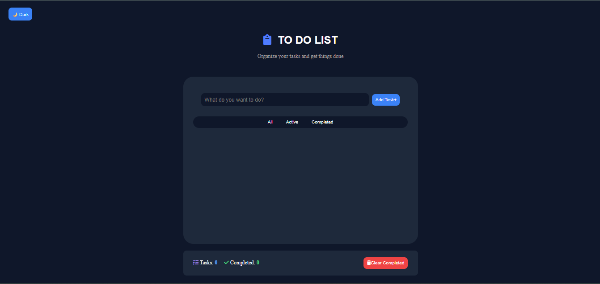

# 📝 To-Do List App

A modern and responsive To-Do List application built using **HTML, CSS, and JavaScript**.

This project helps users organize their daily tasks with a clean interface and persistent data storage.

## 🚀 Features

- ✅ Add new tasks
- ✏️ Edit existing tasks
- 🗑️ Delete individual tasks
- 🧹 Clear completed tasks
- ☑️ Mark tasks as completed
- 🔍 Filter tasks:
  - All
  - Active
  - Completed
- 💾 Save tasks using LocalStorage
- 🌙 Dark / Light mode support
- 📱 Responsive design for mobile and desktop

## 🛠️ Technologies Used

- HTML5
- CSS3
- JavaScript (ES6+)
- DOM Manipulation
- LocalStorage API

## 📸 Preview

## 🎯 What I Learned

Through this project, I practiced:

- Creating and manipulating DOM elements
- Handling user events
- Managing application state
- Working with browser storage
- Using JSON.stringify() and JSON.parse()
- Building responsive layouts

## 🔗 Live Demo

(Add your Vercel link here)

## 📂 Project Structure
Todo-List-App/
│
├── index.html
├── styles.css
├── script.js
└── assets/
└── screenshot.png

## 👨‍💻 Author

Mohamed Mokhtar